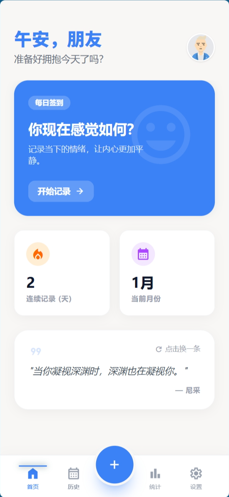
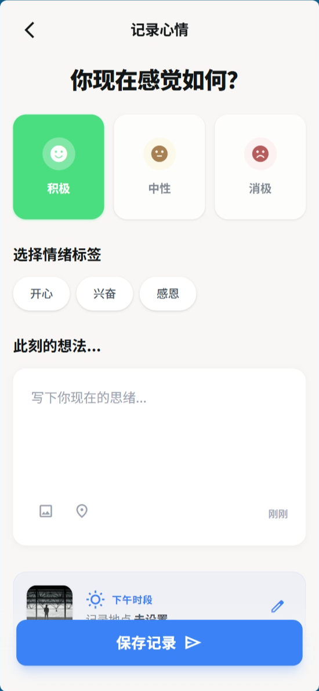
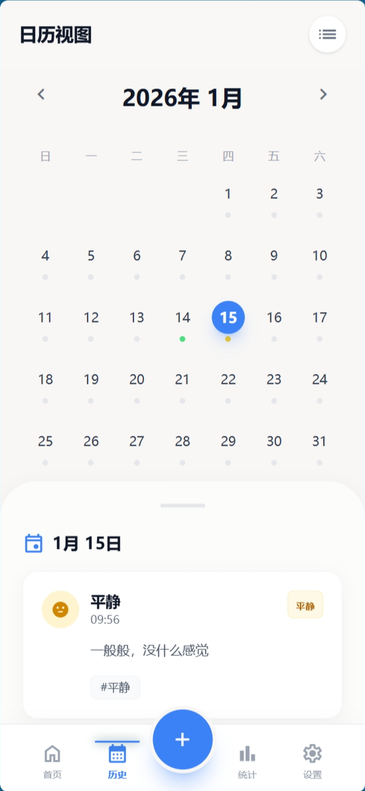
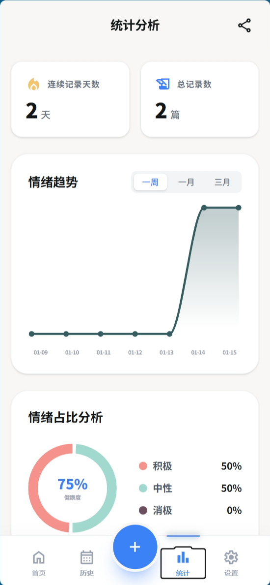
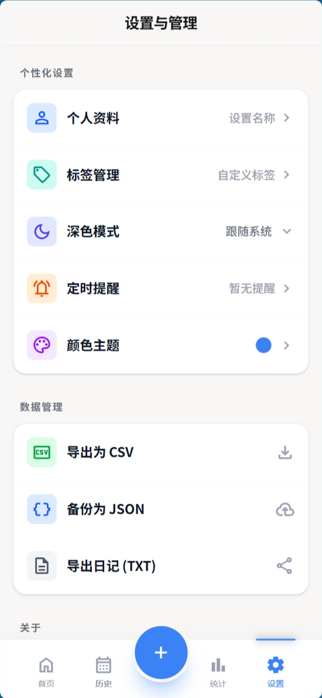

# MoodListener

一个心情记录应用。数据存储在设备本地，不上传云端。
帮助自己记录心情，分析情绪趋势，发现情绪模式。


## 界面预览


| 首页 | 记录心情 | 历史时间线 |
|:---:|:---:|:---:|
|  |  |  |

| 日历视图 | 统计分析 | 设置 |
|:---:|:---:|:---:|
|  |  |  |


## 功能特性

- **心情记录**：三种情绪类型（积极/中性/消极），支持标签、文字、图片附件
- **日历视图**：按日期查看历史记录
- **统计分析**：情绪趋势图表、连续记录天数
- **搜索功能**：快速检索历史记录
- **标签管理**：自定义情绪标签
- **深色模式**：护眼夜间主题
- **提醒通知**：可配置的每日记录提醒
- **本地存储**：数据不离开设备

## 技术实现

```
React + TypeScript + Vite
        │
        ▼
    Capacitor (跨平台桥接)
        │
        ▼
    SQLite (本地持久化)
```

### 核心逻辑

1. **数据模型**：心情分三类 `positive | neutral | negative`，每条记录包含日期、时间、标签、文字内容和可选图片
2. **存储层**：Web 端使用 LocalStorage 降级方案，Android 端使用 `@capacitor-community/sqlite` 直接操作 SQLite
3. **标签系统**：不同情绪类型关联不同的标签池，用户可自定义管理标签
4. **图片存储**：通过 Capacitor Filesystem API 保存到设备本地

### 数据库表结构

```sql
-- 心情记录
entries (id, date, time, mood, title, content, tags, location, images, created_at, updated_at)

-- 用户设置
settings (notification_enabled, notification_time, theme_id, dark_mode)

-- 标签管理
tags (id, name, mood_type, is_default)
```

## 快速开始

```bash
# 安装依赖
npm install

# 开发模式（Web）
npm run dev

# 构建生产版本
npm run build

# 同步到 Android
npx cap sync android

# 打开 Android Studio
npx cap open android
```

> 需要 Node.js 18+ 和 Android Studio（如果要打包 APK）

## 项目结构

```
├── pages/           # 页面组件
│   ├── Home.tsx         # 首页（问候 + 快捷入口）
│   ├── RecordMood.tsx   # 记录心情（核心功能）
│   ├── Timeline.tsx     # 历史时间线
│   ├── Calendar.tsx     # 日历视图
│   ├── Stats.tsx        # 统计分析
│   └── Settings.tsx     # 设置
├── src/storage/     # 数据存储层
│   ├── database.ts      # SQLite 连接管理
│   ├── entries.ts       # 记录 CRUD
│   ├── tags.ts          # 标签管理
│   └── webStorage.ts    # Web 端降级方案
├── services/        # 业务逻辑层
└── android/         # Android 原生工程
```

## 设计决策

- **Web/Native 双模式**：开发时用 Web 调试，部署时打包 APK。存储层做了抽象，自动选择可用的持久化方案
- **标签与情绪绑定**：不同情绪类型展示不同标签集合，减少用户选择成本
- **连续记录激励**：首页展示连续签到天数，提供微小的正反馈循环

## Roadmap

- [ ] 导出数据（JSON/CSV）
- [ ] 情绪趋势图表优化
- [ ] 提醒通知完善
- [ ] iOS 版本

## License

MIT
