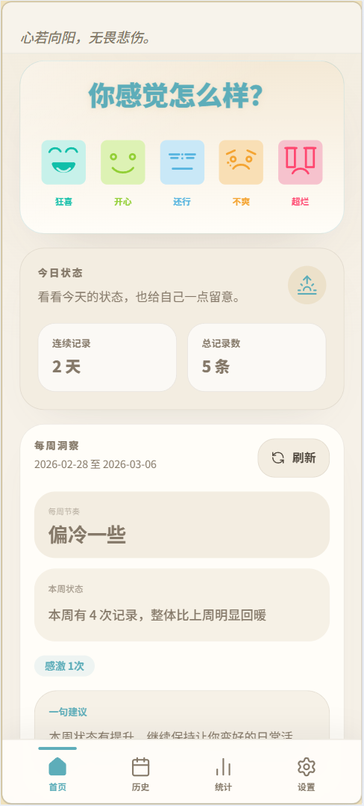
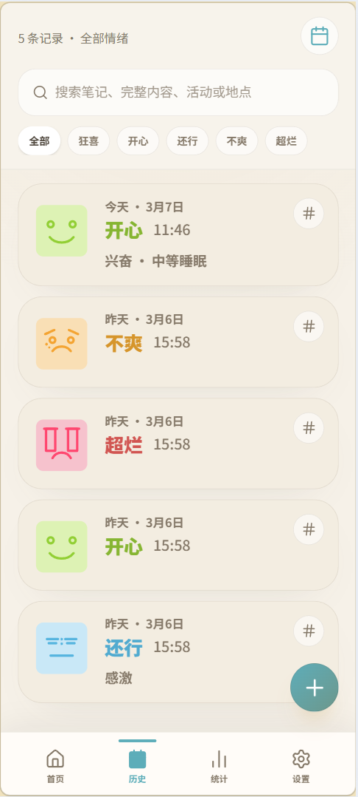
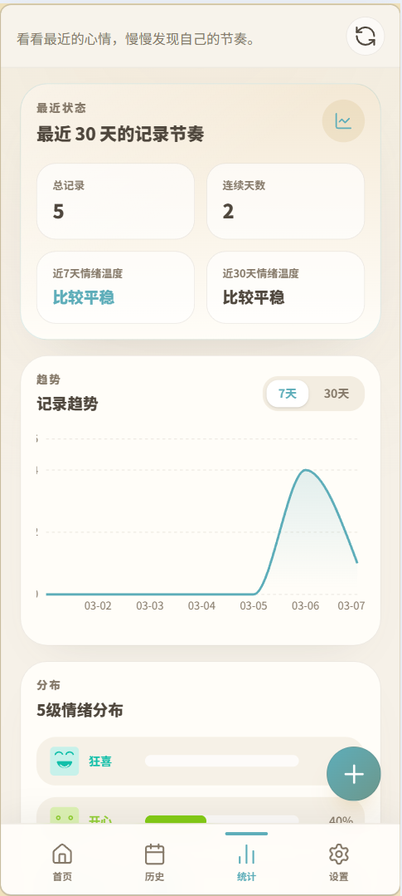
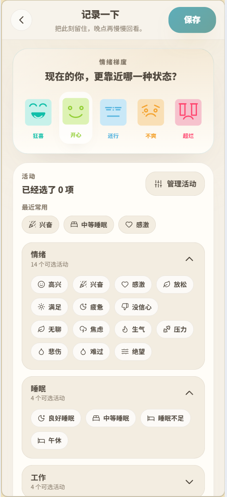
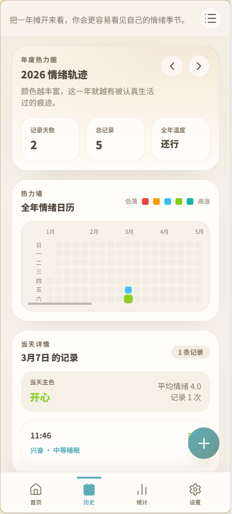
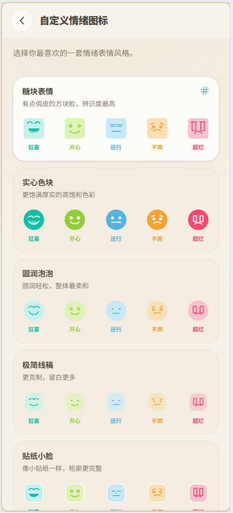
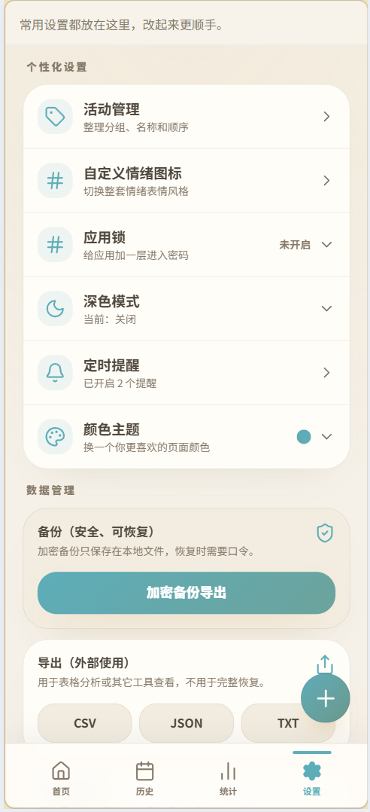

# MoodListener

<div align="center">
  
  <h3>MoodListener</h3>
  <p>一款开源，安全，简单，好用的情绪记录应用</p>
  <p>轻量记录当下感受，回看情绪变化，保留属于自己的生活痕迹。</p>
</div>


## 项目简介

MoodListener 面向日常、轻量的情绪记录场景。应用强调快速输入、低打扰和本地存储，打开后即可开始记录，不依赖云端账号，也不会默认上传个人数据。

它适合用来：

- 快速记录当天情绪和简短想法
- 回顾一段时间内的情绪波动
- 通过日历、历史和统计页面观察个人状态变化
- 在设备本地保存更私密的情绪日志

## 主要功能

- 情绪记录：支持 1-5 级情绪、短备注、长文本、活动、地点、图片和原生音频
- 首页直达：从首页选择情绪后可直接进入记录流程
- 时光胶囊：从过去高情绪记录中抽取温暖片段，在首页底部展示
- 历史回顾：支持搜索和情绪筛选
- 日历视图：提供全年情绪热力图和按日浏览
- 统计分析：查看趋势、分布和更自然的“情绪温度”描述
- 智能提醒：结合时间、周末和近期状态生成更贴合场景的提醒文案
- 数据管理：支持导出、加密备份与恢复
- 个性化设置：支持主题、深浅色、提醒计划和图标包

## 产品特点

- 本地优先：默认保存在设备本地
- 低门槛输入：尽量减少操作成本，让记录更自然
- 渐进式回顾：通过历史、日历、统计逐步呈现情绪规律
- 隐私友好：不以云同步作为前提

## 技术栈

- React 19
- TypeScript
- Vite
- Capacitor
- SQLite
- Tailwind CSS

## 本地运行

```bash
npm install
npm run dev
npm run build
npx cap sync android
npx cap open android
```

运行环境：`Node.js 18+`

## 项目结构

```text
pages/               页面与路由级界面
components/          通用组件
services/            应用服务与跨平台逻辑
src/constants/       文案、主题、情绪元数据
src/storage/         Web 与原生存储实现
android/             Android 原生工程
```

## 数据说明

- Web 端使用本地存储持久化数据
- 原生端使用 SQLite 保存记录、活动、设置等数据
- 加密备份以本地文件形式保存，恢复时需要口令

## 界面预览

<table>
  <tr>
    <td align="center">
      
      <br />
      <strong>首页</strong>
    </td>
    <td align="center">
      
      <br />
      <strong>历史页面</strong>
    </td>
  </tr>
  <tr>
    <td align="center">
      
      <br />
      <strong>统计页面</strong>
    </td>
    <td align="center">
      
      <br />
      <strong>记录页面</strong>
    </td>
  </tr>
  <tr>
    <td align="center">
      
      <br />
      <strong>日历页面</strong>
    </td>
    <td align="center">
      
      <br />
      <strong>自定义情绪图标</strong>
    </td>
  </tr>
  <tr>
    <td align="center" colspan="2">
      
      <br />
      <strong>设置页面</strong>
    </td>
  </tr>
</table>

## License

MIT
