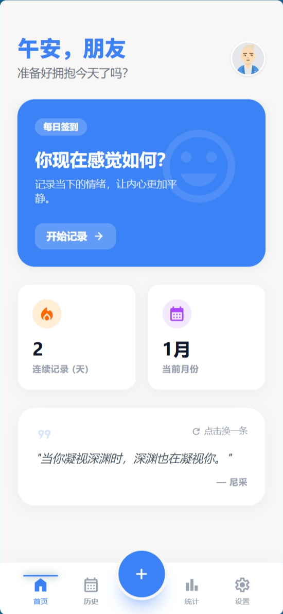
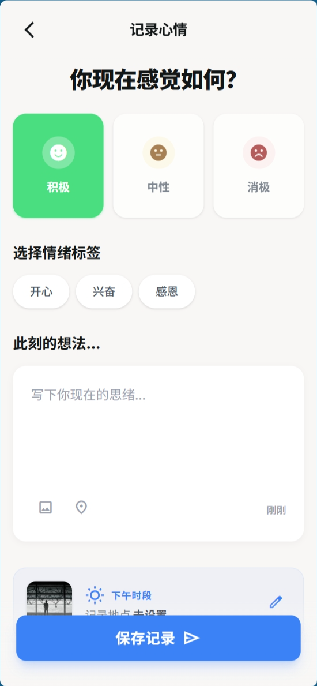
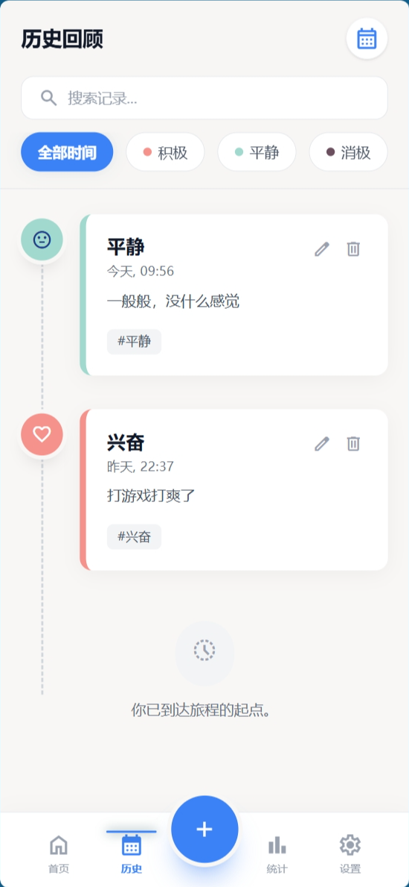
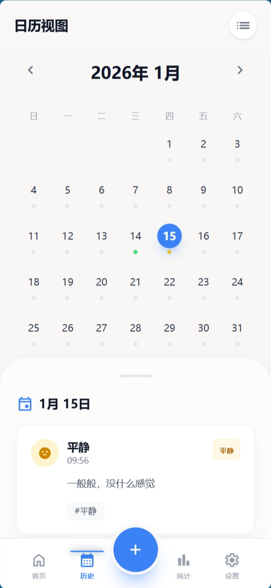
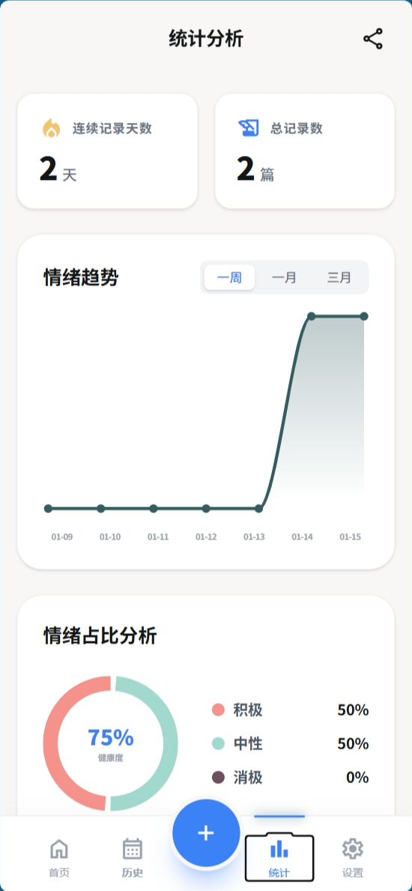
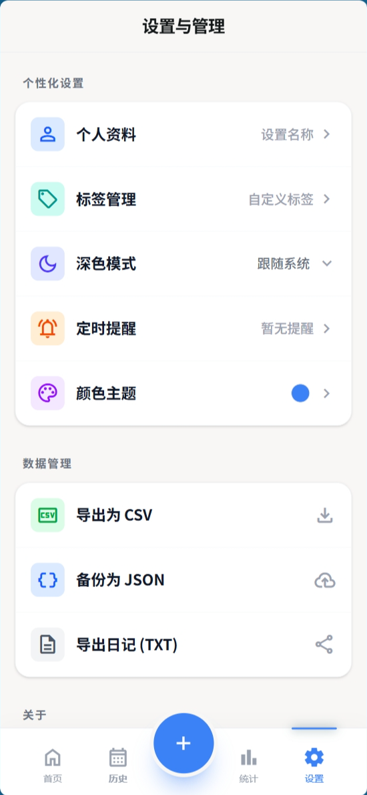

# MoodListener

MoodListener is a local-first mood journaling app. It helps users quickly capture how they feel, revisit patterns over time, and keep personal records on-device without requiring a cloud account.

Current version: `1.3.2`

## Product Direction

- Built for lightweight emotional check-ins, not heavy long-form journaling.
- Uses local storage by default and does not upload data automatically.
- Prioritizes low-friction input so users can start from the Home screen immediately.
- Surfaces patterns gradually through history, calendar, and stats views.

## Current Highlights

- Home now treats "How are you feeling?" as the primary entry point into a new record.
- Home includes a bottom-only Time Capsule card so warm memories appear only when the user intentionally scrolls down.
- Local reminders now plan the next 14 days dynamically instead of repeating one static message forever.
- Native audio journaling supports long-press recording, one saved clip per entry, and playback on the detail page.
- Home and Stats insights now describe mood in more human-readable "mood temperature" language instead of raw scores alone.

## Main Features

- Mood recording with 1-5 mood levels, quick note, full note, activities, location, images, and a native audio clip.
- Home shortcut flow that carries the selected mood directly into the recording page.
- Time Capsule memories drawn from past high-mood entries and shown at the bottom of Home.
- History review with search and mood filtering.
- Calendar view with a full-year mood heatmap and daily browsing.
- Stats view with trends, distributions, and mood-temperature style weekly insights.
- Intelligent local reminders with time-of-day, Friday/weekend, and recent-mood-aware copy, plus same-day do-not-disturb after a saved record.
- Data export and encrypted backup restore.
- Personalization through color themes, dark mode, reminder schedules, and icon packs.

## Tech Stack

- React 19
- TypeScript
- Vite
- Capacitor
- SQLite
- Tailwind CSS

## Run Locally

```bash
npm install
npm run dev
npm run build
npx cap sync android
npx cap open android
```

Required environment: `Node.js 18+`

## Project Structure

```text
pages/               Screens and route-level UI
components/          Shared UI building blocks
services/            App services and cross-platform orchestration
src/constants/       Copy, themes, mood metadata
src/storage/         Web and native storage implementations
android/             Android native project
```

## Data Notes

- Web uses local storage for persistence.
- Native uses SQLite for entries, activities, settings, and profile-like app data.
- Encrypted backups are stored as local files and require a passphrase to restore.

## Screenshots

| Home | Record | History |
|:---:|:---:|:---:|
|  |  |  |

| Calendar | Stats | Settings |
|:---:|:---:|:---:|
|  |  |  |

## License

MIT
